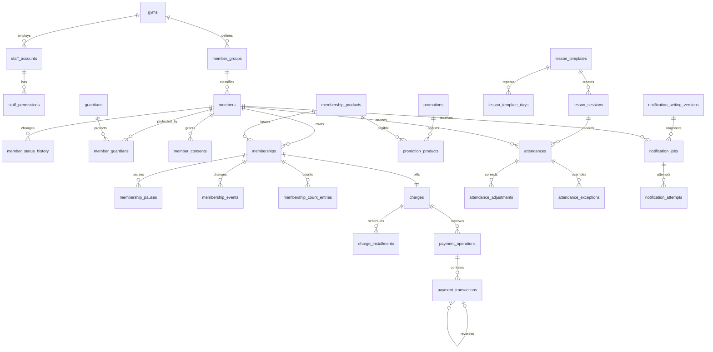

# 데이터베이스 설계

## 목적과 상태

이 문서는 확정된 1차 MVP 정책을 PostgreSQL 17 관계형 모델로 옮긴 기준입니다. 전체 설계는 완료되었고 `auth`·`member` 영역은 **V1**, 상품·행사·발급 회원권·휴회·횟수 원장은 **V2 구현 완료** 상태입니다. 환불과 연결되는 회원권 해지 원장은 V3에 포함합니다.

### 구현 현황

| 버전 | 범위 | 상태 | 구현 파일 |
| --- | --- | --- | --- |
| V1 | 도장 설정, 직원 계정·권한·세션, 감사·아웃박스, 회원·그룹·보호자·관계·동의·이력 | 구현 완료 | `V1__create_core_auth_and_member.sql` |
| V2 | 상품·행사·회원권·휴회·기간 및 횟수 원장 | 구현 완료 | `V2__create_membership_domain.sql` |
| V3 | 청구·분할 납부·결제·취소·환불 원장 | 예정 | - |
| V4 | 수업·출석·출석 정정 | 예정 | - |
| V5 | 알림 설정·발송 작업·공급자 시도 이력 | 예정 | - |

V1·V2는 Flyway 스키마와 JPA 영속 엔티티가 함께 구현되어 있습니다. 애플리케이션 서비스와 HTTP API는 후속 구현 범위입니다.

핵심 목표는 다음과 같습니다.

- 회원, 회원권, 결제, 출석과 알림의 원기록을 삭제하거나 덮어쓰지 않습니다.
- 자주 조회하는 현재 상태는 루트 테이블에 유지하고 모든 중요 변경은 별도 원장에 남깁니다.
- 각 업무 테이블의 소유 모듈을 명확히 하며 다른 모듈은 공개 서비스 또는 이벤트를 통해서만 변경합니다.
- 단일 도장으로 시작하지만 핵심 업무 데이터에 `gym_id`를 포함해 추후 다지점 확장을 허용합니다.

## 공통 규칙

| 항목 | 규칙 |
| --- | --- |
| 내부 기본키 | `bigint generated always as identity` |
| 문자열 | 길이 제한이 업무 규칙인 경우를 제외하고 `text` |
| 발생 시각 | `timestamptz`, DB 저장은 UTC, 화면은 `Asia/Seoul` |
| 영업일·기간 | `date`, 반복 수업 시각은 `time` |
| 금액 | `bigint` 원 단위, 0 이상. 화면에서만 만원 단위로 표시 |
| 횟수·순서 | `integer` 또는 범위가 작은 경우 `smallint` |
| 상태 코드 | 대문자 영문 `text`와 `check` 제약. PostgreSQL enum은 사용하지 않음 |
| 전화번호 | 원문과 숫자만 남긴 `normalized_phone`을 분리 저장 |
| 변경 추적 | 변경 가능한 마스터는 `created_at`, `created_by`, `updated_at`, `updated_by`, `version` 보유 |
| 원장 데이터 | 생성 후 수정·삭제 금지. 정정은 원기록을 참조하는 새 행으로 기록 |
| 삭제 정책 | 업무 데이터는 상태 전환을 사용하고 외래키는 기본 `restrict`; 소유관계의 안전한 하위 데이터에만 `cascade` |
| JSONB | 상품 약관 스냅샷, 감사 전후 값과 외부 공급자 응답처럼 구조가 가변적인 데이터에만 사용 |

개인정보 컬럼은 응답에서 기본 마스킹하고 비밀번호 해시, SOLAPI 비밀 값과 카드 민감정보는 감사 로그나 JSONB에 저장하지 않습니다.

## 전체 관계

## `auth` 모듈

| 테이블 | 주요 컬럼 | 핵심 제약과 용도 |
| --- | --- | --- |
| `gyms` | `id`, `name`, `representative_phone`, `address`, `address_detail`, `member_number_format`, `checkout_enabled` | MVP 도장 한 건. `member_number_format` 기본값 `YYYYMM-####` |
| `staff_accounts` | `id`, `gym_id`, `login_id`, `password_hash`, `name`, `role`, `status`, `must_change_password`, `session_version`, `last_login_at` | `(gym_id, lower(login_id))` 유일. `role`: `ADMIN`, `STAFF`; `status`: `ACTIVE`, `INACTIVE` |
| `staff_permissions` | `staff_account_id`, `permission_code`, `granted_at`, `granted_by` | `(staff_account_id, permission_code)` PK. 직원에게 부여 가능한 코드는 `MEMBER_MANAGE`, `ATTENDANCE_PROCESS`, `PAYMENT_REGISTER`뿐 |
| `auth_refresh_sessions` | `id`, `staff_account_id`, `token_hash`, `session_version`, `expires_at`, `revoked_at`, `created_at` | 원문 토큰 저장 금지. 계정 비활성화 또는 비밀번호 재발급 시 세션 일괄 폐기 |
| `audit_logs` | `id`, `gym_id`, `actor_account_id`, `module`, `action`, `subject_type`, `subject_id`, `reason`, `before_values`, `after_values`, `occurred_at` | 추가 전용. 관리자 예외, 권한, 결제, 회원권과 출석 중요 변경 기록 |
| `outbox_events` | `id`, `aggregate_type`, `aggregate_id`, `event_type`, `payload`, `occurred_at`, `published_at`, `attempt_count` | 업무 트랜잭션과 함께 저장하는 모듈 간 이벤트. 발행 재시도 지원 |

마지막 활성 관리자 보호는 단일 행 제약으로 표현할 수 없으므로 도장 행을 잠근 짧은 트랜잭션에서 활성 관리자 수를 확인한 뒤 역할·상태를 변경합니다.

## `member` 모듈

| 테이블 | 주요 컬럼 | 핵심 제약과 용도 |
| --- | --- | --- |
| `member_number_sequences` | `gym_id`, `year_month`, `last_value` | `(gym_id, year_month)` PK. 행 잠금으로 월별 회원번호를 중복 없이 생성 |
| `member_groups` | `id`, `gym_id`, `name`, `display_order`, `status` | `(gym_id, lower(name))` 유일. 삭제하지 않고 `ACTIVE`, `INACTIVE` 전환 |
| `members` | `id`, `gym_id`, `member_number`, `group_id`, `status`, `name`, `phone`, `normalized_phone`, `birth_date`, `gender`, `address`, `emergency_contact`, `health_notes`, `profile_image_key`, `registered_on`, `membership_expired_at`, `archived_at`, `deletion_requested_at`, `deleted_at` | `(gym_id, member_number)` 유일. 상태는 `ACTIVE`, `CONSULTING`, `EXPIRED`, `ARCHIVED`, `DELETION_REQUESTED`, `DELETED` |
| `member_status_history` | `id`, `member_id`, `from_status`, `to_status`, `effective_at`, `reason`, `changed_by`, `created_at` | 상태 변경 원장. 최초 생성은 `from_status`가 null |
| `member_group_history` | `id`, `member_id`, `from_group_id`, `to_group_id`, `effective_on`, `reason`, `changed_by`, `created_at` | 그룹 변경 전후와 적용일 기록 |
| `guardians` | `id`, `gym_id`, `name`, `phone`, `normalized_phone` | 형제·자매가 같은 보호자를 공유할 수 있는 별도 엔티티 |
| `member_guardians` | `member_id`, `guardian_id`, `relationship`, `is_primary`, `receives_payment_notice`, `receives_lesson_notice` | `(member_id, guardian_id)` 유일. 회원별 주 보호자는 최대 한 명 |
| `member_relationships` | `id`, `lower_member_id`, `higher_member_id`, `lower_to_higher_type`, `higher_to_lower_type` | 두 ID를 오름차순으로 저장하고 `lower_member_id < higher_member_id` 검사. 한 가족 연결은 한 행 |
| `member_consents` | `id`, `member_id`, `guardian_id`, `consent_type`, `document_version`, `agreed`, `decided_at`, `recorded_by` | 개인정보, 광고 문자, 알림톡, 미성년자 보호자 동의를 각각 기록 |
| `member_notes` | `id`, `member_id`, `note_type`, `content`, `created_by`, `created_at` | 상담·운영 메모. 삭제 대신 정정 메모 추가를 기본으로 함 |

중복 후보 검색은 `normalized_phone` 일치 또는 `(name, birth_date)` 일치를 사용합니다. 후보는 자동 병합하지 않으며 보관 회원은 신규 등록 문맥에서만 제한적으로 조회합니다.

## `membership` 모듈

| 테이블 | 주요 컬럼 | 핵심 제약과 용도 |
| --- | --- | --- |
| `membership_products` | `id`, `gym_id`, `name`, `product_type`, `duration_value`, `duration_unit`, `validity_value`, `validity_unit`, `total_count`, `list_price_won`, `sale_status`, 분할·미납·휴회 정책 컬럼 | 유형별 조건부 검사 적용. 정책 기본값은 부분·분할 납부와 휴회 모두 미허용 |
| `promotions` | `id`, `gym_id`, `name`, `starts_on`, `ends_on`, `discount_type`, `discount_value`, `status`, `admin_memo` | 기간 순서, 할인값 양수, 정률 100 이하 검사 |
| `promotion_products` | `promotion_id`, `product_id` | 복합 PK. 정액 할인은 연결 상품 가격보다 작아야 하며 서비스에서 트랜잭션 검증 |
| `memberships` | `id`, `gym_id`, `member_id`, `product_id`, `promotion_id`, `status`, `start_date`, `end_date`, `total_count`, `remaining_count`, `list_price_won`, `discount_won`, `contract_amount_won`, `terms_snapshot`, `version` | 발급 당시 상품·행사·정책 스냅샷 보존. 회원·상품은 발급 후 변경 금지 |
| `membership_pauses` | `id`, `membership_id`, `planned_start_date`, `planned_end_date`, `actual_resumed_on`, `status`, `extension_days`, `reason`, `approved_by`, `created_at` | `PLANNED`, `ACTIVE`, `COMPLETED`, `CANCELLED`. 실제 휴회일만큼 종료일 연장 |
| `membership_events` | `id`, `membership_id`, `event_type`, `from_status`, `to_status`, `old_start_date`, `new_start_date`, `old_end_date`, `new_end_date`, `effective_at`, `reason`, `actor_account_id`, `created_at` | 발급, 시작일 변경, 기간 연장, 해지와 상태 전환 원장 |
| `membership_count_entries` | `id`, `membership_id`, `entry_type`, `delta_count`, `source_type`, `source_id`, `reverses_entry_id`, `reason`, `actor_account_id`, `created_at` | 횟수 원장. `ISSUE`, `ATTENDANCE_DEBIT`, `ATTENDANCE_RESTORE`, `MANUAL_ADD`, `MANUAL_DEDUCT`. 출석 모듈 식별자는 공개 계약 값으로 저장하고 물리 FK를 만들지 않음 |
| `membership_terminations` | `id`, `membership_id`, `refund_operation_id`, `effective_date`, `stop_mode`, `stop_at`, `reason`, `processed_by`, `created_at` | 환불과 선택적으로 연결. `stop_mode`: `IMMEDIATE`, `EFFECTIVE_DATE_START`, `EFFECTIVE_DATE_END` |

상품 유형별 필수값은 다음처럼 제한합니다.

| 유형 | 기간 | 유효기간 | 전체 횟수 |
| --- | --- | --- | --- |
| `PERIOD` | 필수 | 사용 안 함 | 사용 안 함 |
| `COUNT` | 사용 안 함 | 필수 | 필수 |
| `HYBRID` | 필수 | 사용 안 함 | 필수 |

`remaining_count`는 빠른 조회를 위한 현재값이며 `membership_count_entries.delta_count` 합계와 일치해야 합니다. 차감 시 회원권 행을 `for update`로 잠그고 원장 추가와 현재값 갱신을 한 트랜잭션에서 수행하여 0 미만을 방지합니다.

## `payment` 모듈

| 테이블 | 주요 컬럼 | 핵심 제약과 용도 |
| --- | --- | --- |
| `charges` | `id`, `gym_id`, `member_id`, `membership_id`, `plan_type`, `contract_amount_won`, `adjusted_amount_won`, `paid_amount_won`, `balance_won`, `status`, `first_due_on`, `version` | 회원권당 청구 한 건. 결제는 반드시 청구를 참조. 해지 등으로 의무액이 바뀌면 원 계약금액은 보존하고 조정 금액만 변경 |
| `charge_installments` | `id`, `charge_id`, `installment_no`, `due_on`, `amount_won`, `paid_amount_won`, `status` | `(charge_id, installment_no)` 유일. `SCHEDULED`, `PARTIALLY_PAID`, `PAID`, `OVERDUE`, `CANCELLED` |
| `charge_plan_revisions` | `id`, `charge_id`, `revision_no`, `before_plan`, `after_plan`, `reason`, `changed_by`, `created_at` | 납부 계획을 삭제하지 않고 변경 전후 스냅샷 보존 |
| `payment_operations` | `id`, `gym_id`, `charge_id`, `operation_type`, `idempotency_key`, `processed_at`, `processed_by`, `reason`, `memo` | 한 번의 저장 작업 묶음. `REGISTER`, `CANCEL`, `CORRECT`, `REFUND`; `(gym_id, idempotency_key)` 유일 |
| `payment_transactions` | `id`, `operation_id`, `charge_id`, `transaction_type`, `payment_method`, `amount_won`, `original_transaction_id`, `provider`, `external_transaction_id`, `approval_number`, `sync_status`, `created_at` | 금액은 항상 양수. 취소·환불은 원 결제 거래를 참조하며 원거래를 수정하지 않음 |

결제 정정은 `CORRECT` 작업 한 건 안에 원거래의 `CANCELLATION`과 올바른 `PAYMENT` 거래를 함께 생성합니다. 청구 행을 잠근 뒤 거래 추가, 회차 배분과 `paid_amount_won`·`balance_won`·상태 재계산을 한 짧은 트랜잭션으로 처리합니다. 외부 결제 호출은 잠금 트랜잭션 밖에서 수행합니다.

## `lesson`과 `attendance` 모듈

| 테이블 | 소유 | 주요 컬럼 | 핵심 제약과 용도 |
| --- | --- | --- | --- |
| `lesson_templates` | lesson | `id`, `gym_id`, `name`, `lesson_type`, `instructor_account_id`, `start_time`, `end_time`, `active_from`, `active_until`, `display_color`, `status` | 일반·PT 반복 시간표. 종료 시각은 시작보다 늦어야 함 |
| `lesson_template_days` | lesson | `lesson_template_id`, `day_of_week` | 복합 PK, 요일 1~7 |
| `lesson_target_groups` | lesson | `lesson_template_id`, `member_group_id` | 일반 수업 대상 그룹 |
| `lesson_pt_assignments` | lesson | `lesson_template_id`, `member_id`, `membership_id` | 개인 PT 회원 한 명과 유효한 PT 회원권 연결. 템플릿당 활성 행 최대 한 건 |
| `lesson_sessions` | lesson | `id`, `lesson_template_id`, `gym_id`, `session_date`, `starts_at`, `ends_at`, `status` | 반복 템플릿과 날짜별 실제 수업 분리. `(lesson_template_id, session_date, starts_at)` 유일 |
| `attendances` | attendance | `id`, `gym_id`, `member_id`, `lesson_session_id`, `membership_id`, `count_debit_entry_id`, `attendance_type`, `business_date`, `original_check_in_at`, `original_check_out_at`, `current_check_in_at`, `current_check_out_at`, `status`, `counts_for_daily_total`, `created_by`, `created_at` | 원래 시각은 불변, 현재 시각·상태는 이벤트 반영용. `FREE`, `GENERAL_CLASS`, `PT_CLASS` |
| `attendance_adjustments` | attendance | `id`, `attendance_id`, `adjustment_type`, `before_check_in_at`, `after_check_in_at`, `before_check_out_at`, `after_check_out_at`, `reason`, `actor_account_id`, `created_at` | `CANCEL`, `TIME_CORRECTION`. 원출석을 참조하는 추가 전용 이력 |
| `attendance_exceptions` | attendance | `id`, `attendance_id`, `membership_id`, `restriction_type`, `outstanding_amount_won`, `reason`, `approved_by`, `created_at` | 미납·완납 전 제한의 관리자 예외 승인 스냅샷 |

기간권의 일일 집계는 `(gym_id, member_id, business_date)`에서 `counts_for_daily_total = true`인 활성 기록을 최대 한 건으로 제한합니다. 추가 입실이나 수업 참여 기록은 보존하되 집계 플래그를 false로 둡니다. PT 출석은 `(member_id, lesson_session_id)` 활성 기록을 한 건으로 제한하고 같은 트랜잭션에서 `ATTENDANCE_DEBIT` 원장을 한 건 생성합니다. 출석 취소는 원 차감 행을 가리키는 `ATTENDANCE_RESTORE`를 생성합니다.

## `notification` 모듈

| 테이블 | 주요 컬럼 | 핵심 제약과 용도 |
| --- | --- | --- |
| `notification_senders` | `id`, `gym_id`, `provider`, `provider_sender_id`, `phone`, `status` | SOLAPI 등록 발신번호의 로컬 참조. 비밀 키 저장 금지 |
| `notification_test_recipients` | `id`, `gym_id`, `name`, `phone`, `normalized_phone`, `status` | 관리자 테스트 발송 허용 목록 |
| `notification_setting_versions` | `id`, `gym_id`, `version_no`, `enabled`, `send_time`, `title_template`, `body_template`, `sender_id`, `active_from`, `retired_at`, `created_by` | 수정할 때 새 버전 생성. 도장별 현재 버전은 한 건 |
| `notification_jobs` | `id`, `gym_id`, `member_id`, `setting_version_id`, `job_type`, `reregistration_date`, `recipient_name`, `recipient_phone_masked`, `recipient_phone_ciphertext`, `title_snapshot`, `body_snapshot`, `message_type`, `status`, `next_attempt_at`, `attempt_count`, `claimed_at`, `sent_at`, `failure_code` | 실제·테스트 발송과 최종 치환 문구 스냅샷. `PENDING`, `PROCESSING`, `SENT`, `FAILED`, `CANCELLED` |
| `notification_attempts` | `id`, `job_id`, `attempt_no`, `requested_at`, `completed_at`, `provider_message_id`, `result`, `failure_code`, `provider_response` | 공급자 호출별 추가 전용 이력. `(job_id, attempt_no)` 유일 |

실제 재등록 문자는 `(gym_id, member_id, reregistration_date, job_type)` 유일 제약으로 중복 생성을 막습니다. 테스트 발송은 별도 `job_type`을 사용합니다. 여러 워커는 `for update skip locked`로 `PENDING` 작업을 짧게 선점한 뒤 SOLAPI 호출은 트랜잭션 밖에서 수행합니다.

## 주요 검사 제약

- 모든 금액은 0 이상이고 실제 결제 거래 금액은 0보다 큽니다.
- `charges.adjusted_amount_won = paid_amount_won + balance_won`을 유지하고 원래 `contract_amount_won`은 변경하지 않습니다.
- 부분·분할 납부가 꺼진 상품은 최대 분할 횟수와 완납 전 이용 허용 값을 가질 수 없습니다.
- 휴회가 꺼진 상품은 휴회 횟수·기간 정책 값을 가질 수 없습니다.
- 회원권 `remaining_count`는 0 이상이고 횟수형·혼합형에만 존재합니다.
- 정률 할인값은 1~100, 정액 할인값은 0보다 커야 합니다.
- 환불·취소 합계는 참조한 원결제 금액을 초과할 수 없습니다.
- 출석 시간 정정의 퇴실 시각은 입실 시각보다 빠를 수 없습니다.
- 필수 사유가 있는 관리자 조정·예외·취소·환불은 공백 문자열을 허용하지 않습니다.

여러 행이나 여러 테이블을 비교해야 하는 제약은 서비스 트랜잭션과 통합 테스트로 보장합니다. DB `check`는 한 행에서 검증 가능한 조건에 사용합니다.

## 인덱스 계획

PostgreSQL은 외래키 인덱스를 자동 생성하지 않으므로 모든 외래키에 조회 방향에 맞는 인덱스를 둡니다. 주요 복합·부분 인덱스는 다음과 같습니다.

| 인덱스 | 목적 |
| --- | --- |
| `members(gym_id, normalized_phone)` | 전화번호 중복 후보 |
| `members(gym_id, status, created_at desc, id desc)` | 상태별 회원 목록과 커서 페이지네이션 |
| `members(gym_id, name, birth_date)` | 이름·생년월일 중복 후보 |
| `memberships(member_id, status, end_date, id)` | 회원 상세와 만료 예정 |
| `memberships(gym_id, end_date, id) where status = 'ACTIVE'` | 활성 회원권 만료 조회 |
| `memberships(gym_id, remaining_count, id) where status = 'ACTIVE' and remaining_count is not null` | PT 잔여 부족 조회 |
| `membership_count_entries(membership_id, created_at desc, id desc)` | 횟수 원장 |
| `charges(gym_id, status, first_due_on, id)` | 납부 예정·미납 목록 |
| `charge_installments(status, due_on, id) where status in ('SCHEDULED','PARTIALLY_PAID','OVERDUE')` | 미납 회차 처리 |
| `payment_transactions(charge_id, created_at desc, id desc)` | 결제·환불 이력 |
| `lesson_sessions(gym_id, session_date, starts_at, id)` | 주간 시간표 |
| `attendances(member_id, business_date desc, id desc)` | 회원 출석 이력 |
| `unique attendances(gym_id, member_id, business_date) where counts_for_daily_total and status = 'ACTIVE'` | 기간권 일일 집계 중복 방지 |
| `unique attendances(member_id, lesson_session_id) where status = 'ACTIVE' and attendance_type = 'PT_CLASS'` | 동일 PT 수업 중복 출석·차감 방지 |
| `unique membership_count_entries(source_type, source_id, entry_type) where source_type = 'ATTENDANCE'` | 출석별 차감·복원 중복 생성 방지 |
| `notification_jobs(status, next_attempt_at, id) where status in ('PENDING','FAILED')` | 발송 워커와 실패 재처리 |
| `audit_logs(gym_id, subject_type, subject_id, occurred_at desc, id desc)` | 대상별 감사 이력 |
| `outbox_events(occurred_at, id) where published_at is null` | 미발행 이벤트 처리 |

큰 목록 API는 `offset` 대신 `(정렬값, id)` 기반 커서 페이지네이션을 사용합니다.

## 트랜잭션과 잠금 순서

| 작업 | 한 트랜잭션에서 처리할 항목 |
| --- | --- |
| 회원번호 발급 | 월별 시퀀스 행 잠금 → 번호 증가 → 회원 생성 |
| PT 출석 | 회원권 행 잠금 → 출석 중복 확인·생성 → 차감 원장 생성 → 잔여 횟수 감소 |
| PT 출석 취소 | 출석 행 → 회원권 행 순으로 잠금 → 취소 이력 → 복원 원장 → 잔여 횟수 증가 |
| 결제 등록·취소·환불 | 청구 → 회차 → 회원권 순으로 잠금 → 작업·거래 생성 → 청구 합계와 상태 재계산 |
| 마지막 관리자 변경 | 도장 행 잠금 → 활성 관리자 수 확인 → 계정 상태·역할 변경 |
| 알림 선점 | 작업 한 건 `skip locked` 선점과 상태 변경만 커밋 → 외부 호출 → 결과 기록 |

여러 행을 잠글 때는 항상 ID 오름차순을 사용하고 외부 API 호출이나 사용자 입력 대기를 DB 트랜잭션 안에서 수행하지 않습니다.

## 보존과 개인정보 처리

- 결제 거래, 회원권·횟수 원장, 출석 원기록, 알림 발송 결과와 감사 로그는 물리 삭제하지 않습니다.
- `ARCHIVED`는 검색 제외 상태일 뿐 회원과 이력을 다른 테이블로 복사하지 않습니다.
- 삭제 요청은 회원 PII를 익명화하고 법정 보존이 필요한 결제·감사 데이터와 분리합니다. 구체적인 보관 기간은 운영 전 법률 검토 후 확정합니다.
- 전화번호 암호화가 필요한 운영 환경에서는 애플리케이션 계층의 키 관리 서비스로 암복호화하고 검색용 `normalized_phone_hash`를 별도 운영하는 방안을 적용합니다.
- 감사 JSON에는 비밀번호 해시, 토큰, SOLAPI 자격 증명, 전체 카드번호와 불필요한 건강정보를 기록하지 않습니다.

## Flyway 구현 순서

1. `V1__create_core_auth_and_member.sql`
2. `V2__create_membership.sql`
3. `V3__create_payment.sql`
4. `V4__create_lesson_and_attendance.sql`
5. `V5__create_notification.sql`
6. `V6__seed_default_gym_and_groups.sql`

초기 관리자 비밀번호는 마이그레이션에 평문이나 고정 해시로 넣지 않습니다. 별도 초기화 명령에서 환경 변수로 받아 BCrypt 또는 Argon2 해시를 생성합니다. 각 Flyway 버전은 대응 JPA 엔티티와 통합 테스트를 같은 변경에 포함합니다.

## 구현 검증 항목

- 모든 외래키에 적절한 인덱스가 있는지 검사합니다.
- 상품 유형별 조건부 컬럼과 정책 on/off 조합을 DB 통합 테스트로 검증합니다.
- 동시 PT 출석에서 한 번만 차감되고 잔여 횟수가 음수가 되지 않는지 검증합니다.
- 동시 결제에서 청구 잔액 초과가 발생하지 않는지 검증합니다.
- 같은 회원·재등록일의 문자 작업이 한 건만 생성되는지 검증합니다.
- 마지막 활성 관리자를 동시에 비활성화할 수 없는지 검증합니다.
- 원장 테이블에 일반 수정·삭제 경로가 존재하지 않는지 아키텍처 테스트로 확인합니다.

[위키 홈](index.md) · [아키텍처](architecture.md) · [API 및 데이터 모델](api-and-data.md)
